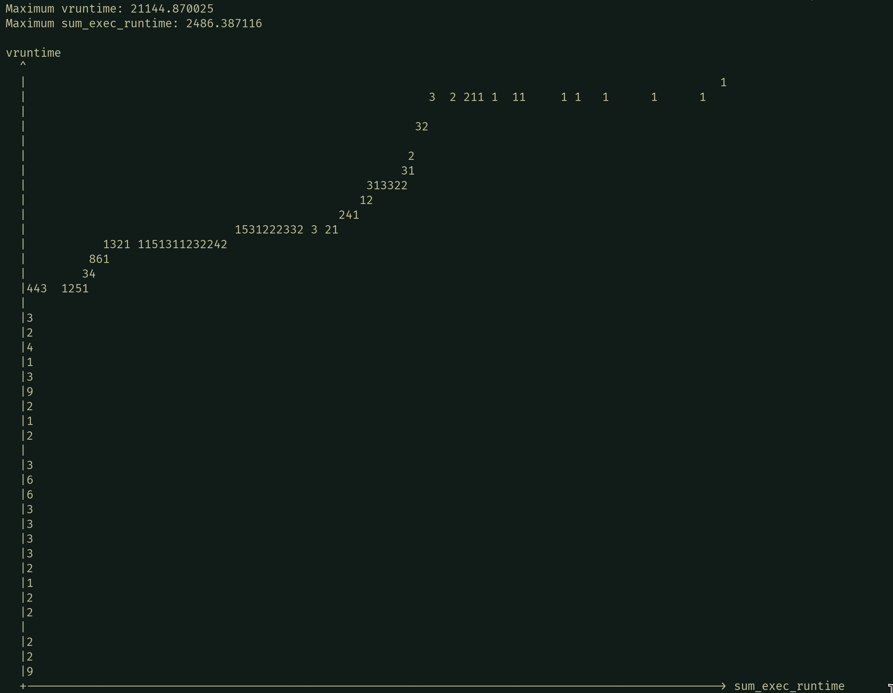
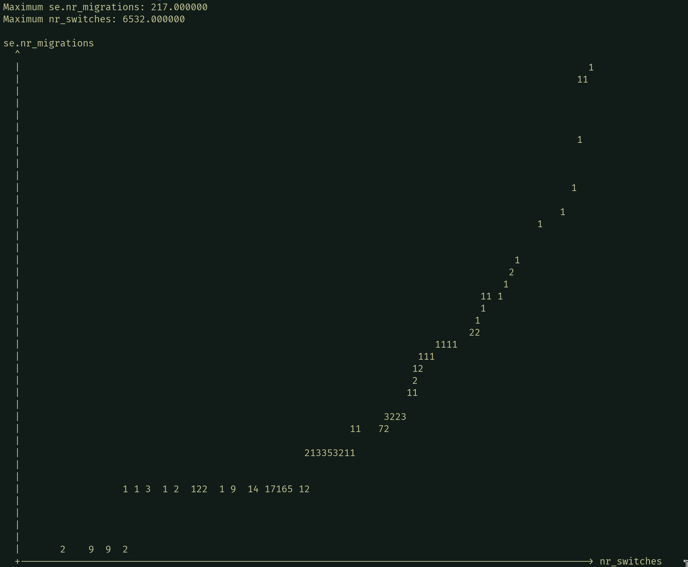
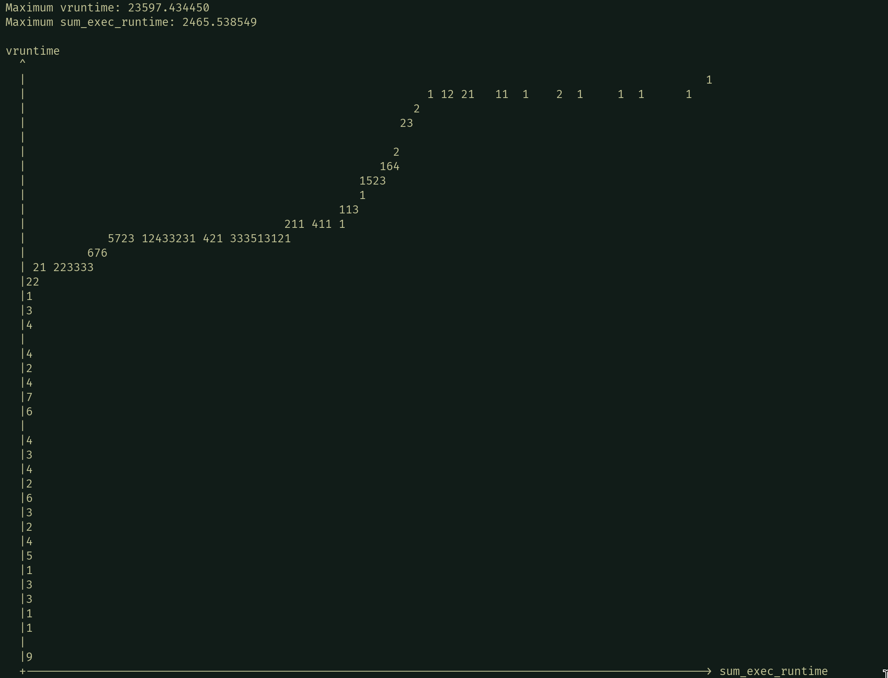
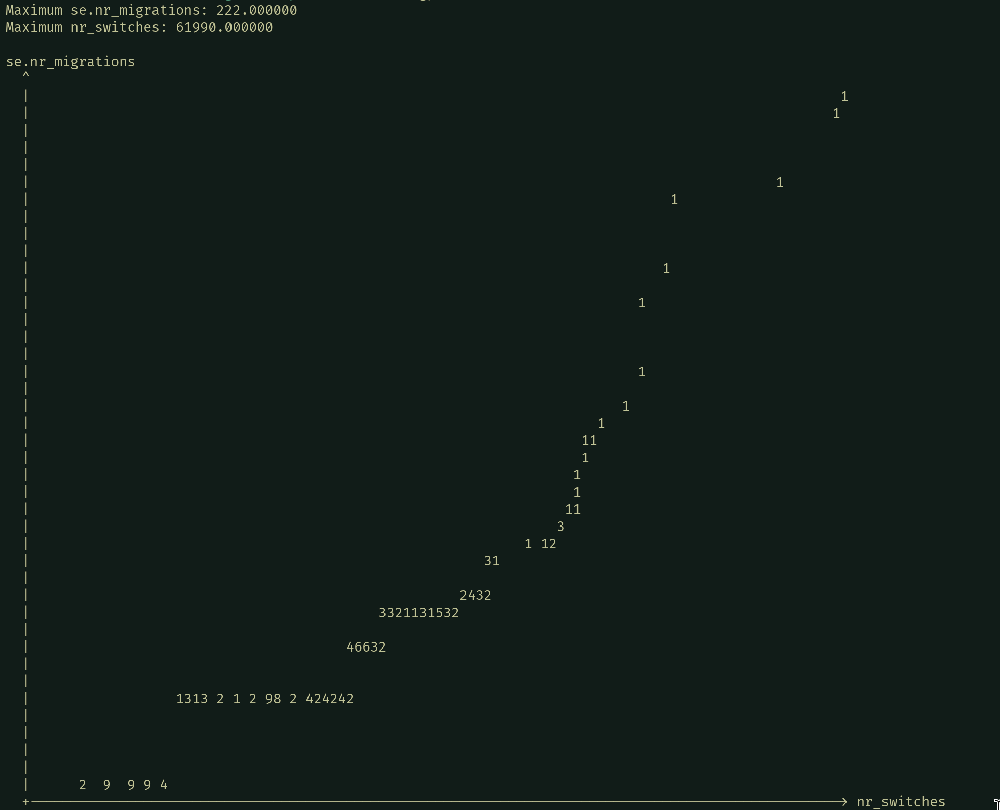
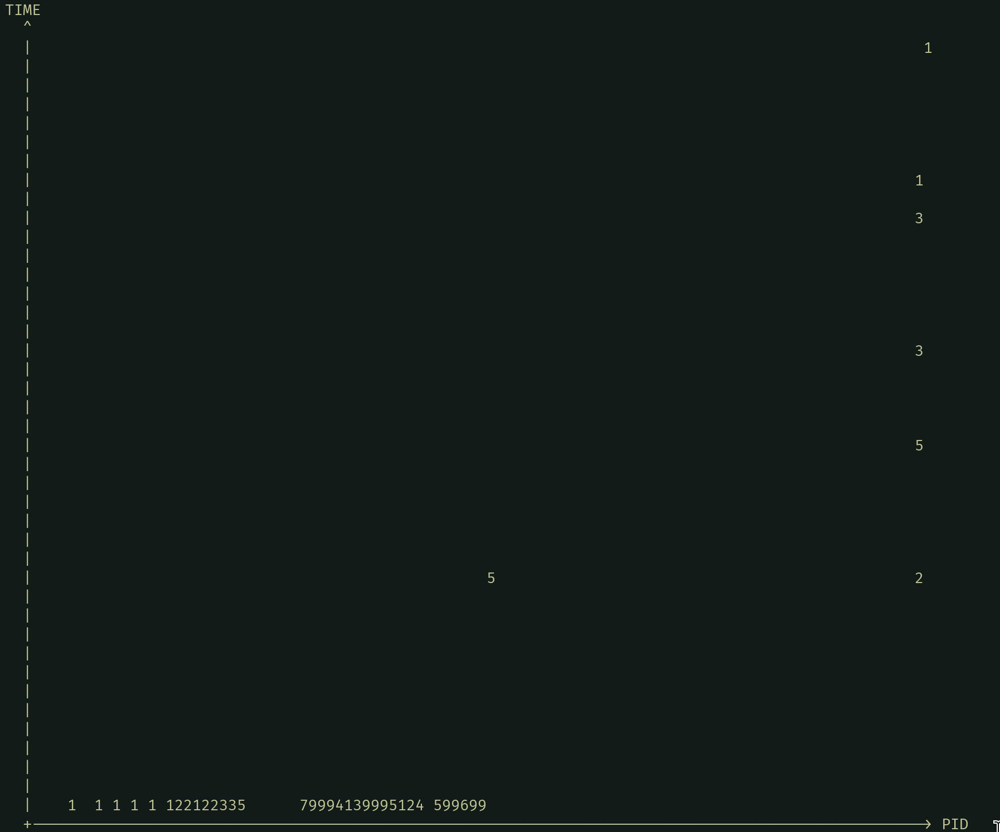
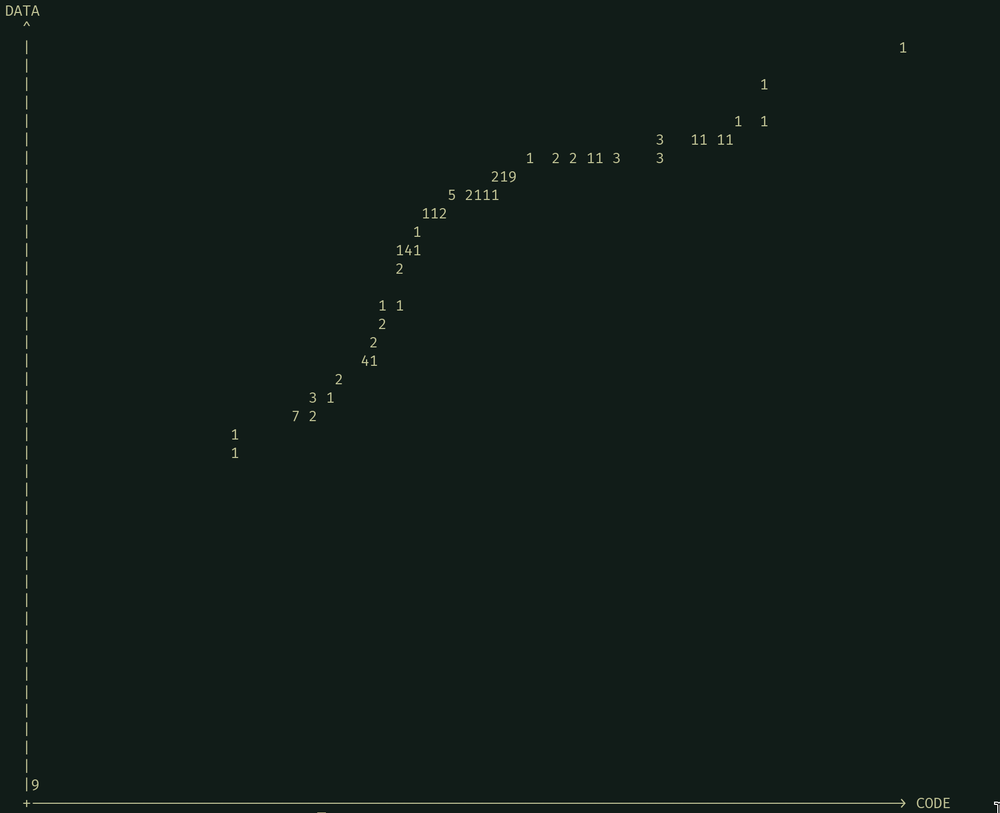
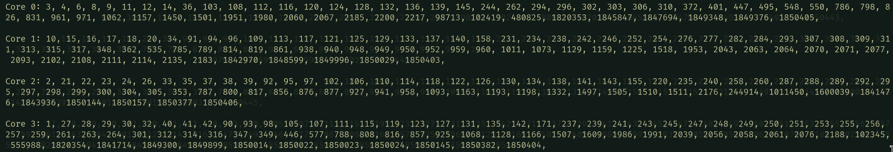
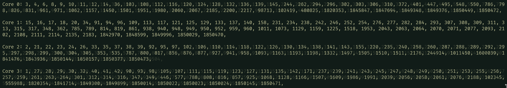
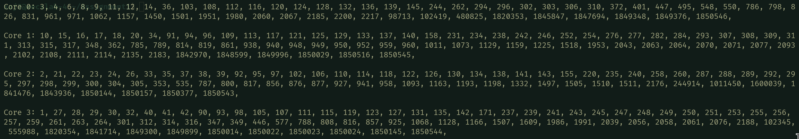
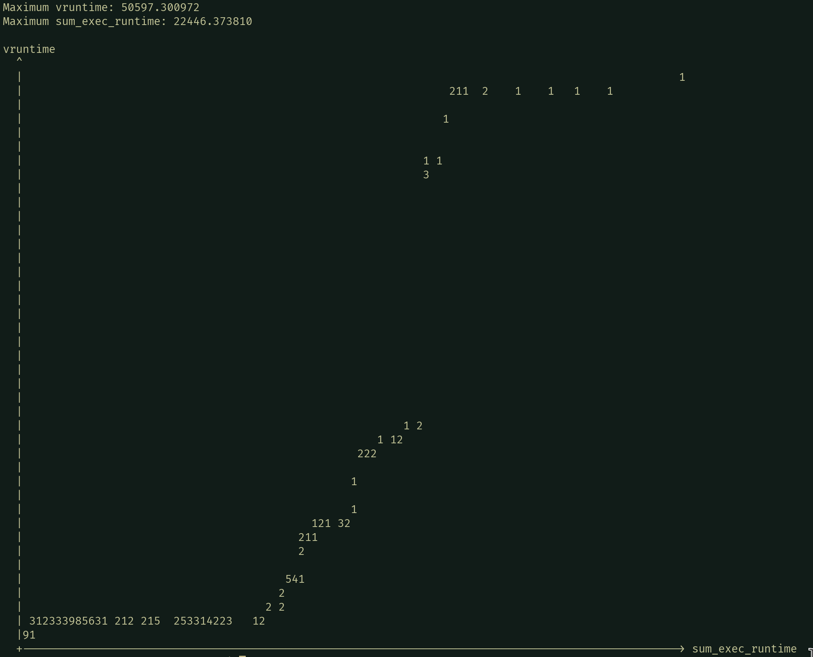

## 1. Scatter Plots & Relationships among `/proc/*/sched` Statistics

I wrote the following awk script to create a scatter plot from any two variables
in the in the `/proc/*/sched` files. `sched_scatter_plot.awk`:

```awk
BEGIN {
  num_processes = 0;

  if (x_axis=="") { x_axis = "sum_exec_runtime"; }
  if (y_axis=="") { y_axis = "vruntime"; }

  if (x=="") { x = 100; }
  if (y=="") { y = 30; }
}

FNR == 1 {
  num_processes++;
}

match($1, y_axis) { y_axis_vals[num_processes-1]=$3; next; }
match($1, x_axis) { x_axis_vals[num_processes-1]=$3; next; }

END {
  asort(y_axis_vals);
  asort(x_axis_vals);

  printf("Maximum %s: %f\n", y_axis, y_axis_vals[num_processes]);
  printf("Maximum %s: %f\n\n", x_axis, x_axis_vals[num_processes]);

  if (log_scale_x > 1 || log_scale_y > 1) {
    for (i=1; i<=num_processes; i++) {
      if (log_scale_x) {
        x_axis_vals[i] = log(x_axis_vals[i] + 1) / log(log_scale_x);
      } if (log_scale_y) {
        y_axis_vals[i] = log(y_axis_vals[i] + 1) / log(log_scale_y);
      }
    }
  }

  print y_axis;

  x_max = x_axis_vals[num_processes];
  y_max = y_axis_vals[num_processes];
  x_scale = (x_max > 0) ? x / x_max : 1;
  y_scale = (y_max > 0) ? y / y_max : 1;

  for (i=1; i<=num_processes; i++) {
    x_coord = int(x_scale * x_axis_vals[i]);
    y_coord = int(y_scale * y_axis_vals[i]);

    plot[x_coord, y_coord] += 1;
    if (plot[x_coord, y_coord] > 9) { plot[x_coord, y_coord] = 9; }
  }

  print "  ^";
  for (curr_y=y; curr_y >= 0; curr_y--) {
    printf "  |";
    for (curr_x=0; curr_x<=x; curr_x++) {
      printf (plot[curr_x, curr_y] ? plot[curr_x, curr_y] : " ");
    }
    printf "\n";
  }

  printf "  +";
  for (i=0; i<x; i++) { printf "-"; }
  printf ("> %s\n", x_axis);
}
```

> Note: I prompted ChatGPT with the prompt "Why isn't the graph produced by this
> awk graph scaling correctly" in order to debug an error in my code.

This awk script was used to generate log-scaled graphs showing the relationship
between the inputted variables. The numbers on the graphs represent how many
processes had the corresponding relationship between the variables, i.e. how
many dots there would be at any given position in a scatter plot.

Before generating the graphs, I restarted the virtual machine and waited a
approximately 10 minutes to make the data consistent with section 2.



> Note: I now realize that I was supposed to make this graph showing
> log(vruntime) vs sum_exec_runtime, not both log-scaled. However, it took
> forever to actually get the data from sections 1 and 2 to be consistent
> outside of the kernel parameters, so I am just going to leave a correct graph
> in the Appendix, sorry about that.

Figure 1 shows the relationship of vruntime and total CPU runtime of
all the processes on my root machine. There is a relatively strong logarithmic
correlation between vruntime and total CPU time.
Figure 1 was produced using the following
bash command:

```bash
awk -f sched_scatter_plot.awk -v x=100 -v y=40
  -v x_axis=sum_exec_runtime
  -v y_axis=vruntime
  -v log_scale_x=2
  -v log_scale_y=2
  /proc/*/sched
  > vruntime_vs_sumexectime.plot
```


Figure 2 shows the relationship of voluntary and involuntary context
switches of all the processes on my root machine; there is a relatively strong direct
correlation. It was produced using
the following bash command:

```bash
awk -f sched_scatter_plot.awk -v x=100 -v y=40
  -v x_axis=nr_voluntary_switches
  -v y_axis=nr_involuntary_switches
  -v log_scale_x=2
  -v log_scale_y=2
  /proc/*/sched
  > voluntary_vs_involuntary_switches.plot
```



Figure 3 shows the relationship of context switches and CPU migrations of
all the processes on my root machine; there is a relatively strong direct
relationship. It was produced using the following
bash command:

```bash
awk -f sched_scatter_plot.awk -v x=100 -v y=40
  -v x_axis=nr_switches
  -v y_axis=se.nr_migrations
  -v log_scale_x=2
  -v log_scale_y=2
  /proc/*/sched
  > switches_vs_migrations.plot
```

## 2. `/proc/*/sched` Statistics with Kernel Parameter Manipulation

For this section, I began by creating a bash script that increased all of the
specified kernel parameters by a factor of 10:

```bash
sysctl -w kernel.sched_latency_ns=60000000 
  -w kernel.sched_migration_cost_ns=5000000
  -w kernel.sched_min_granularity_ns=7500000
  -w kernel.sched_nr_migrate=320
  -w kernel.sched_rr_timeslice_ms=1000
  -w kernel.sched_rt_period_us=10000000
  -w kernel.sched_rt_runtime_us=9500000
  -w kernel.sched_shares_window_ns=100000000
```

> Note: the last two kernel parameters specified by the assignment
> (kernel.sched_shares_window_ns and kernel.sched_time_avg_ms) didn't exist
> on my root machine according to `sysctl`.

Then, I restarted the virtual machine and ran the bash script to change the
parameters immediately. I then waited 10 minutes and generated the plots in the
using the same script and commands as section 1:






After increasing the kernel parameters tenfold, the relationship between voluntary
and involuntary switches changed the most out of the three graphs created.

As figures 5 and 6 show, the number of context switches after multiplying the kernel
parameters increased by a factor of about 10 from a maximum of 6532 to 61990
switches. Additionally, the number of involuntary_switches actually decreased
despite the larger number of switches; this was likely due to the increased
timeslice, which allowed processes to finish their work within a timeslice more
often and give up their CPU time voluntarily more often.

> Note that the spread of these graphs look very similar despite tenfold
> differences due to the log-scaling and differences in zooming/linear scaling.

Another notable comparison is that, although the number of switches increased
dramatically, the number of migrations actually stayed somewhat constant,
meaning there were 10x more switches per migration. This
is probably due to increasing the cost of migration.

The relationship between vruntime and total CPU time stayed approximately the
same after changing the kernel parameters.

## 3. Scatter Plots & Relationships for `top` Statistics

For this section, I began by enabling the `CODE` and `DATA' fields in my`.toprc` configuration, then
I used the following command to output the top data to a file for the awk script
to read:

```bash
top -b -n 1 > top.out
```

Then, I manipulated my scatter_plot awk script from section 1 so that I could
read data from the top output and specify the top fields that I want to read:

```awk
BEGIN {
  num_processes = 0;
  processing_lines_bool = 0;

  if (x_axis=="") { x_axis = "PID"; }
  if (y_axis=="") { y_axis = "TIME"; }

  if (x=="") { x = 100; }
  if (y=="") { y = 30; }
}


match($0, x_axis) && match($0, y_axis) {
  processing_lines_bool = 1;
  print $0;

  for (i=1; i<100; i++) {
    if (match($i, x_axis)) {
      x_col = i;
    }
    if (match($i, y_axis)) {
      y_col = i;
    }
  }

  next;
}

processing_lines_bool { num_processes++;
  x_axis_vals[num_processes]=$x_col;
  y_axis_vals[num_processes]=$y_col;
}

END {
  print num_processes;

  if (!processing_lines_bool) {
    print "Processes not found";
    exit;
  }

  asort(y_axis_vals);
  asort(x_axis_vals);

  print y_axis;

  if (log_scale_x > 1 || log_scale_y > 1) {
    for (i=1; i<=num_processes; i++) {
      if (log_scale_x) {
        x_axis_vals[i] = log(x_axis_vals[i] + 1) / log(log_scale_x);
      } if (log_scale_y) {
        y_axis_vals[i] = log(y_axis_vals[i] + 1) / log(log_scale_y);
      }
    }
  }

  x_max = x_axis_vals[num_processes];
  y_max = y_axis_vals[num_processes];
  x_scale = (x_max > 0) ? x / x_max : 1;
  y_scale = (y_max > 0) ? y / y_max : 1;

  for (i=1; i<=num_processes; i++) {
    x_coord = int(x_scale * x_axis_vals[i]);
    y_coord = int(y_scale * y_axis_vals[i]);

    plot[x_coord, y_coord] += 1;
    if (plot[x_coord, y_coord] > 9) { plot[x_coord, y_coord] = 9; }
  }

  print "  ^";
  for (curr_y=y; curr_y >= 0; curr_y--) {
    printf "  |";
    for (curr_x=0; curr_x<=x; curr_x++) {
      printf (plot[curr_x, curr_y] ? plot[curr_x, curr_y] : " ");
    }
    printf "\n";
  }

  printf "  +";
  for (i=0; i<x; i++) { printf "-"; }
  printf ("> %s\n", x_axis);

}
```



Figure 10 shows the relationship between process ID and total CPU time of
all the processes the machine. It was produced using the following
bash command:

```bash
awk -f top_scatter_plot.awk -v x_axis="PID" -v y_axis="TIME" -v y=40
  -v log_scale_x=2 -v log_scale_y=2 top.out
```

The relationship between `TIME` and `PID` shows that (for the most part) only
processes with very high process IDs last a very long time.



Figure 11 shows the relationship between the size of executable's machine
code  and the corresponding amount of memory the process has allocated for
all the processes on the machine. It was produced using
the following bash command:

```bash
awk -f top_scatter_plot.awk -v x_axis="CODE" -v y_axis="DATA" -v y=40
  -v log_scale_x=2 -v log_scale_y=2 top.out
```

This relationship shows that the amount of machine code in a program and the
amount of data that program uses is directly correlated.

## 4. CPU Migrations Animation

This was the C program that I wrote (i.e. my modification of `c3.c`) to create
an animation showing which processes were on which CPU core.

```c
#include <stdio.h>
#include <stdlib.h>
#include <string.h>

int main() {
  FILE *fp;
  char pid[10], user[32], pr[8], ni[8], virt[16], res[16], shr[16], s[4];
  char cpu[8], mem[8], time[32], command[128];
  unsigned p;

  char final_strings[4][2048];

  for (int i = 0; i < 10; i++) {
    memset(final_strings, 0, sizeof(final_strings));

    system("top -b -n 1 | tail -n +8 | sort > out.top");

    fp = fopen("out.top", "r");
    if (fp == NULL) {
      perror("Error opening file");
      return 1;
    }

    char buffer[1024];

    while (fgets(buffer, sizeof(buffer), fp) != NULL) {
      sscanf(buffer, " %s %s %s %s %s %s %s %s %s %s %s %s %d\n", pid, user, pr,
             ni, virt, res, shr, s, cpu, mem, time, command, &p);
      char pid_buf[32];
      sprintf(pid_buf, "%s, ", pid);
      strcat(final_strings[p], pid_buf);
    }

    for (int p = 0; p < 4; p++) {
      printf("Core %d: %s\n\n", p, final_strings[p]);
    }

    fclose(fp);

    system("sleep 1");
    system("clear");
  }

  return 0;
}
```

> The my changes from c3.c to this code are shown in the Appendix.

I compiled it and ran it to create the following output snapshots:





## Appendix

Here is a scatter plot showing `log(vruntime)` vs. `sum_exec_runtime`; there is
a weak linear correlation.



Here is a representation of the changes from `c3.c` to my
animation code powered by AI and the prompt "Show the differences between
these two code segments using the formatting of a more reader friendly git
diff"

```c
Line 3:
+ #include <string.h>

Lines 8-12:
+ unsigned p;
+ char final_strings[4][2048];
+ for (int i = 0; i < 10; i++) {
+   memset(final_strings, 0, sizeof(final_strings));
+   system("top -b -n 1 | tail -n +8 | sort > out.top");

Lines 14-15:
- for (int i = 0; i < 7; i++) fgets(buffer, sizeof(buffer), fp);

Lines 17-19:
- sscanf(buffer, " %s %s %s %s %s %s %s %s %s %s %s %s\n",
-             pid, user, pr, ni, virt, res, shr, s, cpu, mem, time, command);
- printf("PID: %s\tTIME: %s\n", pid, time);

Lines 20-27:
+ sscanf(buffer, " %s %s %s %s %s %s %s %s %s %s %s %s %d\n", pid, user, pr,
+        ni, virt, res, shr, s, cpu, mem, time, command, &p);
+ char pid_buf[32];
+ sprintf(pid_buf, "%s, ", pid);
+ strcat(final_strings[p], pid_buf);
+ }
+ for (int p = 0; p < 4; p++) {
+   printf("Core %d: %s\n\n", p, final_strings[p]);

Lines 30-32:
+ system("sleep 1");
+ system("clear");
+ }
```
