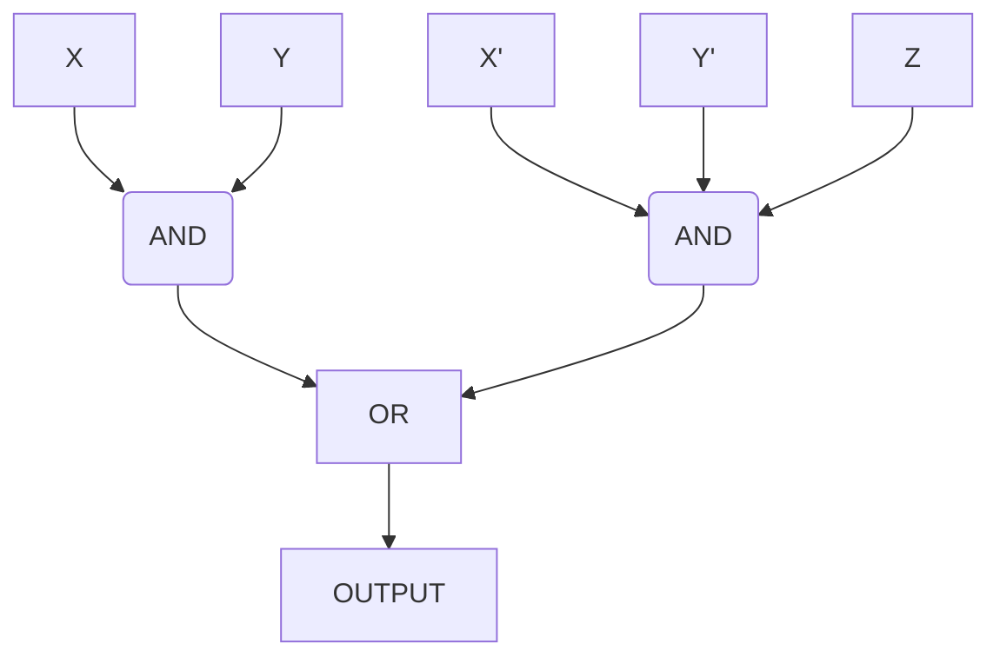

# Circuits that Process Binary

## Binary Operations Review

### Example: $n=4$

- $5_{10}-2_{10}=+3_{10}$
- Plug 5 and 2 into the adder circuit, However,
  - Take the complement of the two, and enable the carry in input
- $0101_2+1101_2+1_2=10011_2=3_10$

> Overflow check: If the carry out of the MSB is the
same as the carry into the MSB, then there is no overflow.
If they don't match, then there was overflow

## Physical Voltages

Most modern systems use voltages between 0 and 5V

Note: A 0 doesn't correspond to 0V, and a 1 doesn't correspond to 5V, e.g.

- Maybe everything from 3.5V - 5V is defined as HIGH voltage
- and everything from 0V - 1.5V is LOW voltage
- This means that anything from 1.5V - 3.5V is UNDEFINED
  - This undefined region helps protect against random 'noise' affecting voltage

### Combinational Circuits (No Memory)

This is the type of circuit that we will work with up until the midterm.

- Outputs depend only on the current input
- No 'data' is stored in 'memory'
- The operation is fully describe by a truth table

Combinational circuits are like pure functions.

### Sequential Circuit (w/ Memory)

- Outputs depends on the current input and the sequence of past inputs
- Operation is described by a state table

## Combinational Circuits

Any combinational circuit is described by three basic functions:

- AND
- OR
- NOT

These operations can be used to build any combinational digital logic circuit

### AND Gate

The gate looks like a 'D' with two lines going into the straight side,
and one line coming out of the right side.

- "X and Y"
- "X $\land$ Y"
- "X $\cdot$ Y"

|X|Y|F=X $\cdot$ Y|
|:-:|:-:|:-:|
|0|0|0|
|0|1|0|
|1|0|0|
|1|1|1|

### OR Gate

The gate looks like a arrow pointing right: ')>' with two lines going into the
curvy side, and one line coming out of the pointy side.

- "X or Y"
- "X $\lor$ Y"
- "X $+$ Y"

|X|Y|F=X $+$ Y|
|:-:|:-:|:-:|
|0|0|0|
|0|1|1|
|1|0|1|
|1|1|1|

### NOT Gate

Looks like "|>o"

- "Not X"
- " ~X "
- " X' "

|X|X'|
|:-:|:-:|
|1|0|
|0|1|

### Order of Operations

- Parenthesis
- NOT
- AND
- OR

Note: 'AND' has precedence over 'OR'

- Think about how AND is like multiplication and OR is like adding

## Circuits

Two wires can never be joined without a gate

### Example

$$(X \cdot Y) + (X' \cdot Y' \cdot Z)$$

You can also draw this circuit somewhat like this:

Because this is a combinational circuit, this can be
represented as a truth table

### Timing Diagrams

In this class, we will treat the voltage changes as if they are instantaneous,
even though they are not

They are honestly self explanatory, it's a timeline that shows when certain inputs
are active. You can also have corresponding outputs of combinational circuits.

Note: Sometimes the output of a combinational circuit has a delay from the
change of the inputs. Be very careful about the output taking time to change when
there is an input change.

## More Gates

### NAND Gate (AND then NOT)

- $(X \cdot Y)'$
- When there is a 'NOT' after a gate, you add a circle to the end
  - "Do"

It is **VERY IMPORTANT** that you do the 'NOT' **AFTER** the 'AND'

### NOR Gate (OR then NOT)

- $(X + Y)'$
- ")>o"

Again, do the 'NOT' **AFTER** the 'OR'

### XOR Gate (Called a "Difference Gate")

It's the same as like '!=';
returns whether or not there is a different between the two inputs

- It looks like the 'OR' gate, but with an extra curve: '))>'
- Represented as $(X \oplus Y)$

|$X$|$Y$|$X \oplus Y$|
|:-:|:-:|:-:|
|0|0|0|
|0|1|1|
|1|0|1|
|1|1|0|

Minor note, the Verilog linter doesn't recognize XOR

### XNOT Gate (XOR then NOT)

- $(X \oplus Y)'$
- "))>o"
