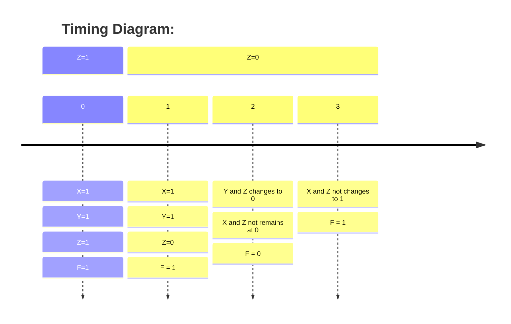

# Timing Hazards

- Analysis methods so far ignored the circuit delay and we only studied
the steady-state behaviour.
- Because of the circuit delays, the transient behaviour may be different
than the steady-state.

## What is a Timing Hazard?

- A timing hazard occurs whenever a circuit's output may produce a short
pulse called a glitch at a time when steady-state analysis predicts
no change.
- A hazard is said to exist when a circuit has the possibility of
producing a glitch.

## Types of Hazards

I missed it :(

## Timing Analysis

### Example 1

$$F = X \cdot Z' + Y \cdot Z$$

> This is called a sum of products

Let's say you had $XYZ = 111$ and $Z$ switches such that now you have $111$.
This has the potential to cause a timing hazard.

Let's say every gate takes 1 time unit of delay

- The NOT gate in $X \cdot Z'$ take longer than no NOT gate
- This means that $Y \cdot Z$ switches to '0' before $X \cdot Z'$ switches to
  '1'.
Therefore, there could be a small time interval (1 time unit) where the
expression evaluates to '0' instead of '1'. e.g. F = 0 at t=2

## How do you fix timing hazard?

You must introduce the consensus term; remember:

$$X \cdot Z' + Y \cdot Z = X \cdot Z' + Y \cdot Z + X \cdot Y$$

If you changed $F = X \cdot Z' + Y \cdot Z$ to $F = X \cdot Z' +
Y \cdot Z + X \cdot Y$,
the timing hazard would disappear.
