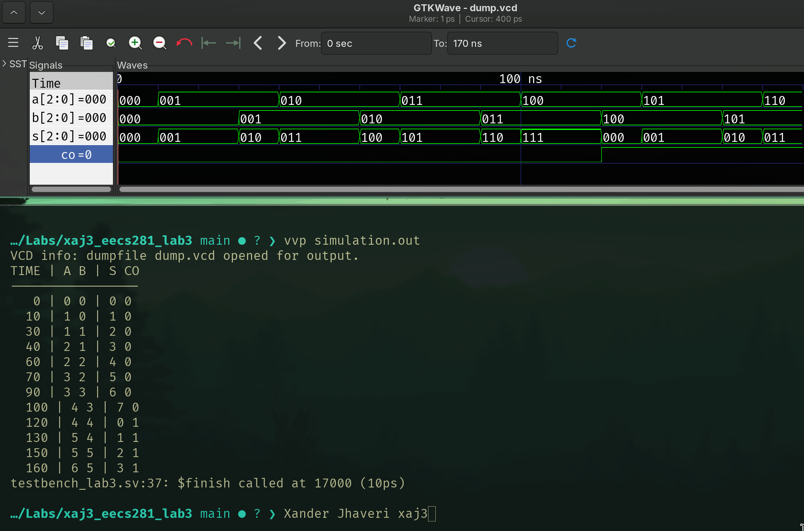

# Xander Jhaveri - Lab 3



## rc_adder_slice.sv

```sv
module rc_adder_slice (
    input  logic a,
    b,
    c_in,
    output logic s,
    c_out
);
  assign s = a ^ b ^ c_in;
  assign c_out = a & b | b & c_in | a & c_in;

endmodule
```

## rc_adder4.sv

```sv
module rc_adder4 (
    input logic [2:0] a,
    input logic [2:0] b,
    output logic [2:0] s,
    output logic co
);

  logic [3:0] c;
  assign c[0] = 0;

  rc_adder_slice adders[2:0] (
      .a(a),
      .b(b),
      .c_in(c[2:0]),
      .s(s),
      .c_out(c[3:1])
  );

  assign co = c[3];

endmodule
```

## testbench_lab3.sv

```sv
`timescale 1ns / 10ps

module testbench_lab3 ();

  logic [2:0] a, b, s;
  logic co;

  rc_adder4 UUT (
      .a (a),
      .b (b),
      .s (s),
      .co(co)
  );

  initial begin
    a = 0;
    b = 0;
    forever begin
      #10 a++;
      #20 b++;
    end
  end

  initial begin
    // The following 2 lines output the file as a waveform
    // because I didn't use Model Sim
    $dumpfile("dump.vcd");
    $dumpvars(0, testbench_lab3);

    $display("TIME | A B | S CO");
    $display("-----------------");
    $monitor("  %2d | %d %d | %d %b", $time, a, b, s, co);

    #170;
    $finish();
  end

endmodule
```
