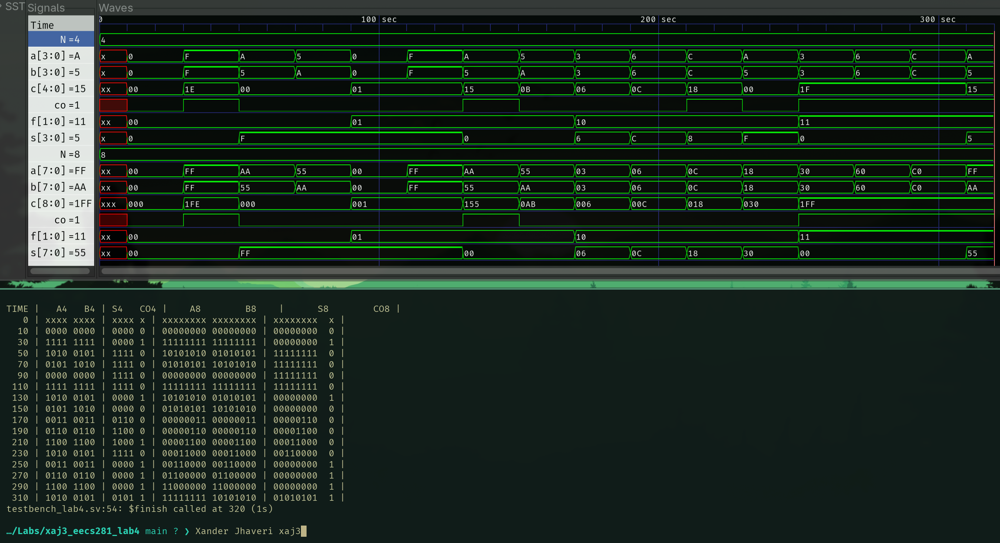

## Screenshot of Output



## `rc_adder_slice.sv`

```sv
module rc_adder_slice (
    input  logic a,
    b,
    c_in,
    output logic s,
    c_out
);
  assign s = a ^ b ^ c_in;
  assign c_out = a & b | b & c_in | a & c_in;
endmodule
```

## `alu_slice.sv`

```sv
module alu_slice (
    input  logic       a,
    b,
    c_in,
    input  logic [1:0] f,
    output logic       s,
    c_out
);

  logic b_inv, c;

  assign b_inv = b ^ f[0];
  assign c     = c_in & f[1];
  rc_adder_slice U1 (
      .a(a),
      .b(b_inv),
      .c_in(c),
      .s(s),
      .c_out(c_out)
  );
endmodule
```

## `gen_alu.sv`

```sv
module gen_alu #(
    parameter N = 8
) (
    input  logic [N-1:0] a,
    b,
    input  logic [  1:0] f,
    output logic [N-1:0] s,
    output logic         co
);

  logic [N:0] c;

  assign c[0] = f[0];
  assign co   = c[N];

  alu_slice U[N-1:0] (
      .a(a),
      .b(b),
      .c_in(c[N-1:0]),
      .f(f),
      .s(s),
      .c_out(c[N:1])
  );
endmodule

```

## `testbench_lab4.sv`

```sv
module testbench_lab4 ();
  logic [3:0] a4, b4, s4;
  logic [7:0] a8, b8, s8;
  logic [1:0] f;
  logic co4, co8;

  logic        clk;
  logic [25:0] tvs   [15:0];
  int          i = 0;

  gen_alu #(
      .N(4)
  ) UUT4 (
      .a (a4),
      .b (b4),
      .f (f),
      .s (s4),
      .co(co4)
  );

  gen_alu #(
      .N(8)
  ) UUT8 (
      .a (a8),
      .b (b8),
      .f (f),
      .s (s8),
      .co(co8)
  );

  initial begin
    clk = 1'b0;
    forever #10 clk = ~clk;
  end

  always @(posedge clk) begin
    f  = tvs[i][25:24];
    a4 = tvs[i][23:20];
    b4 = tvs[i][19:16];
    a8 = tvs[i][15:8];
    b8 = tvs[i][7:0];
    i++;
  end

  initial begin
    $dumpfile("dump.vcd");
    $dumpvars(0, testbench_lab4);

    $readmemb("test_vectors.txt", tvs);
    $display("TIME |   A4   B4 | S4   CO4 |    A8        B8    |      S8        CO8 | ");
    $monitor(" %3d | %4b %4b | %4b %b | %8b %8b | %8b  %b |", $time, a4, b4, s4, co4, a8, b8, s8,
             co8);
    #320 $finish();
  end
endmodule
```
