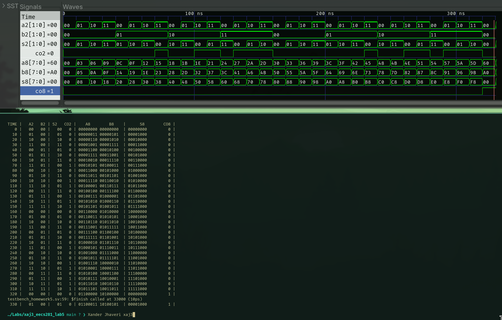

## Screenshot of Output



## cla_adder.sv

```sv
module cla_adder #(
    parameter N = 8
) (
    input logic [N-1:0] a,
    input logic [N-1:0] b,
    input logic c_in,
    output logic [N-1:0] s,
    output logic c_out
);

  logic [N-1:0] p, g;
  logic [N:0] c;

  assign p = a ^ b;
  assign g = a & b;

  for (genvar i = 0; i <= N; i++) begin
    if (i == 0) assign c[i] = c_in;
    else assign c[i] = g[i-1] | (p[i-1] & c[i-1]);
  end

  assign s = p ^ c[N-1:0];
  assign c_out = c[N];
endmodule
```

## testbench.sv

```sv
`timescale 1ns / 10ps
module testbench_lab5 ();

  logic [1:0] a2, b2, s2;
  logic [7:0] a8, b8, s8;
  logic co2, co8;


  cla_adder #(
      .N(2)
  ) UUT2 (
      .a(a2),
      .b(b2),
      .c_in(0),
      .s(s2),
      .c_out(co2)
  );

  cla_adder #(
      .N(8)
  ) UUT8 (
      .a(a8),
      .b(b8),
      .c_in(0),
      .s(s8),
      .c_out(co8)
  );

  initial begin
    a2 = 0;
    forever #10 a2++;
  end

  initial begin
    b2 = 0;
    forever #40 b2++;
  end

  initial begin
    a8 = 0;
    forever #10 a8 += 3;
  end

  initial begin
    b8 = 0;
    forever #10 b8 += 5;
  end

  initial begin
    $dumpfile("dump.vcd");
    $dumpvars(0, testbench_lab5);

    $display("TIME |   A2   B2 | S2   CO2 |    A8        B8    |      S8        CO8 | ");
    $monitor(" %3d | %4b %4b | %4b %3b | %8b %8b  | %8b  %8b |", $time, a2, b2, s2, co2, a8, b8,
             s8, co8);

    #330 $finish();
  end

endmodule
```
