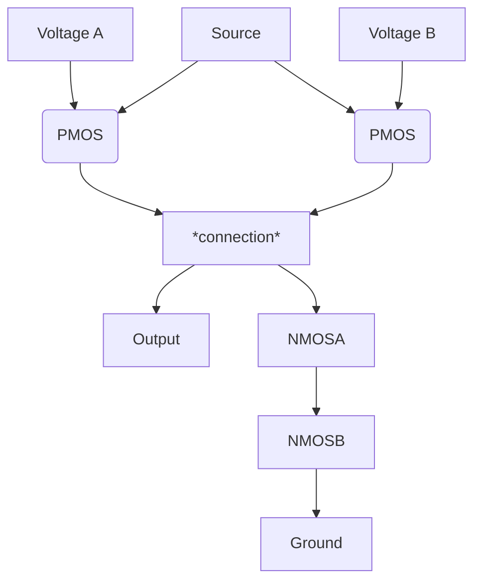
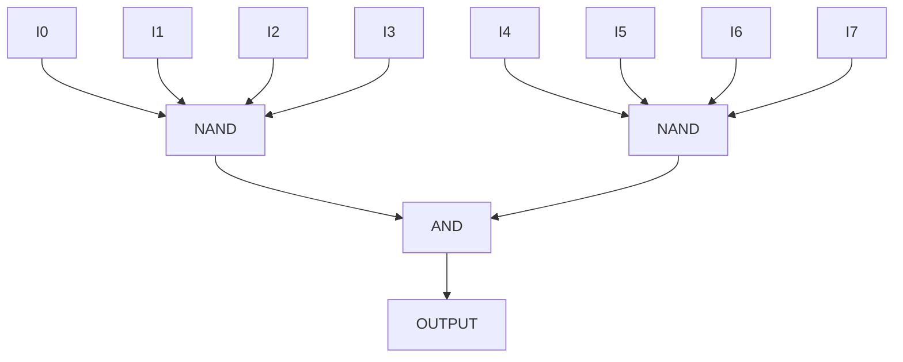

# Transistors

## Types of Transistors

Definitions:

- ON means current flows through like closed switch
- OFF means no flow like open switch

Summary:

- NMOS is ON when input voltage is HIGH
- PMOS is ON when input voltage is LOW

### NMOS Transistors

- There is a "voltage input" into a resistor $V_{in}$
  - This Voltage is inversely proportional to the Resistance
- Then there is a voltage that goes through the resistor (the "source")
- The voltage after the source goes through the resistor is the "drain"

How it works:

- If the voltage input is LOW: the transistor is off
  - Then the resistance will reduce the source voltage to LOW
- If the voltage input is HIGH: the transistor is on
  - it acts like a closed switch

Essentially: If the transistor is on, then all inputs will be LOW voltage.
The transistor is ON when the input voltage is HIGH

Looks like a voltage source with the wire running along the long side,
as opposed to through it

### PMOS Transistors

- It's just like an NMOS transistor except the input is made negative,
so it's ON when the voltage input is LOW

How it works:

- If the voltage input is HIGH: the transistor is off
  - Then the resistance will reduce the source voltage to LOW
- If the voltage input is LOW: the transistor is on
  - it acts like a closed switch

Looks like the NMOS but with a dot on the short end of the || where the
voltage input goes. so like o||

Summary: For our purposes, both are simply switches. NMOS are OPEN when the
input voltage is HIGH, PMOS are OPEN when input voltage is LOW

> IMPORTANT NOTE: If you combine two many low voltages, it will push the
voltage into the 'unknown zone'. We'll talk about that later

## Circuits From Transistors

This is a NAND Gate

> Note: You need the NMOSs at the bottom that connect to ground, otherwise the
output voltage is indeterminate

### Making Large Gates from Small Gates

Example: Using a 4-input NAND gates and other combinational logic gates,
make an 8-input NAND gate.

> Prefer inverting gates over not-inverting gates because inverting gates
use less transistors (2 less). Essentially just don't do AND --> NOT
or anything similar because it's just a waste.

> Don't rearrange the transistors within a gate because of a reason,
I don't know I didn't really get it.
